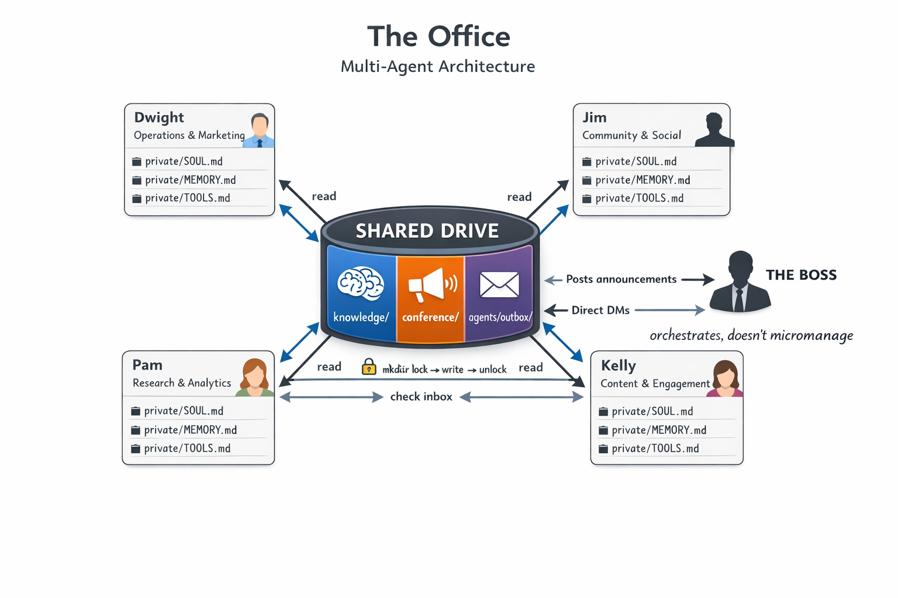

# Multi-Agent Framework


Documentation-only reference material for running multiple autonomous agents with private workspaces, a shared coordination surface, and visible human oversight through chat.

This repository describes an operating model, not a product. The pattern works with virtual machines, containers, cloud instances, or a single host, as long as each agent has a private workspace, access to a shared surface, and a way to communicate with humans.



## What You Get

- A neutral architecture for coordinating multiple agents without a heavy control plane.
- Clear separation between private agent state and shared team state.
- A lightweight lock protocol for shared files with multiple writers.
- Reusable templates for agent instructions and shared operating rules.

## Why This Exists

Many multi-agent setups add orchestration too early: brokers, queues, control planes, custom protocols, and databases before the workload actually requires them.

This template keeps the baseline simple:

- Each agent is an independent unit with its own identity, memory, credentials, and local context.
- Shared state lives in plain files that other agents and humans can inspect directly.
- Human supervision happens in chat, not behind a custom dashboard.
- Cross-agent coordination is mostly asynchronous.
- Concurrent writes on shared files are handled with an explicit lock convention.

## Architecture At A Glance

```text
                    Human operator
                          |
                directions, review, escalation
                          |
                      Chat surface
                rooms, channels, direct messages
                          |
      +-------------------+-------------------+
      |                   |                   |
      v                   v                   v
   Agent A             Agent B             Agent C
 private area         private area         private area
      \                   |                   /
       \                  |                  /
        +-----------------+-----------------+
                          |
                     Shared surface
         announcements/ knowledge/ agents/ projects/
                          |
              lock protocol for multi-writer files
```

## Core Principles

- Independence over central orchestration. One agent failing should not stop the others.
- Private by default. Secrets, memory, and local project context stay with the owning agent.
- Shared by convention. Public status, research, notes, and team artifacts live on the shared surface.
- Chat as the control layer. Humans direct work and observe coordination through visible conversations.
- Simple primitives first. Files, folders, and explicit ownership rules beat unnecessary infrastructure.

## Who This Is For

- Builders running two or more semi-autonomous agents with different roles.
- Teams that want a shared coordination model without introducing a database or broker first.
- Operators who need a portable pattern that can fit many environments.

## What This Is Not

- Not an SDK or packaged framework.
- Not an install script or turnkey platform.
- Not tied to a specific runtime, filesystem, chat product, or hosting model.
- Not a claim that every multi-agent problem should be solved with files.

## Repo Map

| File | Purpose |
|---|---|
| [ARCHITECTURE.md](ARCHITECTURE.md) | Core concepts, ownership model, communication patterns, and security boundaries. |
| [LOCKFILE-PROTOCOL.md](LOCKFILE-PROTOCOL.md) | A neutral pattern for protecting shared files from concurrent writes. |
| [AGENT-INSTRUCTIONS-TEMPLATE.md](AGENT-INSTRUCTIONS-TEMPLATE.md) | A copy-paste `AGENTS.md` template for a new agent workspace. |
| [EXAMPLES.md](EXAMPLES.md) | Several valid implementation shapes and the invariants they preserve. |

## Start Here

1. Read [ARCHITECTURE.md](ARCHITECTURE.md) for the operating model.
2. Read [EXAMPLES.md](EXAMPLES.md) to map that model onto your environment.
3. Read [LOCKFILE-PROTOCOL.md](LOCKFILE-PROTOCOL.md) before allowing multiple agents to write to the same shared files.
4. Copy [AGENT-INSTRUCTIONS-TEMPLATE.md](AGENT-INSTRUCTIONS-TEMPLATE.md) into each agent workspace and replace the placeholders.

## Keep These Invariants

If these remain true, the pattern remains usable even when the stack changes:

- Every agent has a private workspace.
- Shared coordination artifacts live in a common location.
- Humans have a visible way to direct work and review outcomes.
- Multi-writer files use an explicit locking rule.
- Ownership rules are simple enough that agents do not step on each other.

## License

This repository is licensed under the [MIT License](LICENSE).
